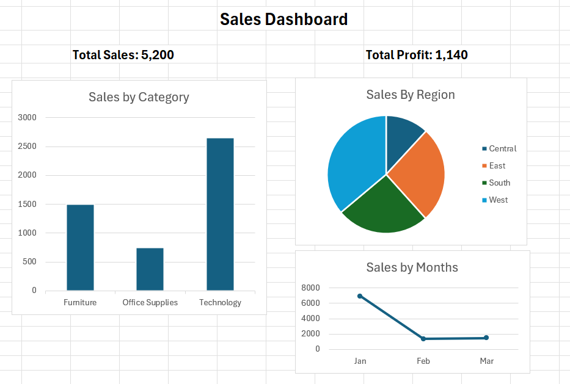

# Sales Data Analysis in Excel

## Overview
This project analyzes sales data using Microsoft Excel. The project includes data organization, pivot table analysis, chart creation, and a simple dashboard to show key business insights.

## Tools Used
- Microsoft Excel
- Pivot Tables
- Bar Chart
- Pie Chart
- Line Chart

## Project Goals
- Analyze sales by category
- Analyze sales by region
- Track monthly sales trend
- Present findings in a dashboard format

## Dashboard Preview

## Key Insights
- Technology generated the highest sales among all categories
- West region showed the strongest sales performance
- Monthly sales changed significantly across the selected months

## Files Included
- `Sales-data-analysis.xlsx` - Excel file with data, analysis, and dashboard
- `Dashboard.png` - Screenshot of the dashboard
- `Sales.xlsx` - Raw dataset (if uploaded)

## What I Learned
- How to clean and organize data in Excel
- How to create pivot tables for analysis
- How to build charts and dashboards for reporting

## Author
Supraja
